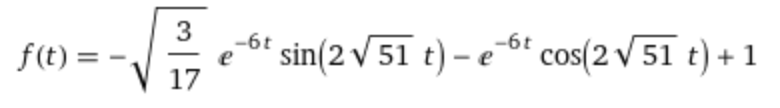

# Spring animation

This project has been created in order to understand deeper how spring animation works, after discover [this amazing article](https://medium.com/@dtinth/spring-animation-in-css-2039de6e1a03).

The goal is to solve the following damped spring equation:

```
f''(t) = -k(f(t) - 1) - cf'(t)
```

with

```
f(0) = 0; f'(0) = 0;
```

`f(t)` beeing the position,
`f'(t)` the velocity,
`f''(t)` the acceleration,
`c` the damping coefficient and `k` the stiffness of the spring

Example of solution for `k = 240` and `c = 12` on [WolframAlpha](https://www.wolframalpha.com/input?i=f%280%29+%3D+0%3B+f%27%280%29+%3D+0%3B+f%27%27%28t%29+%3D+-240%28f%28t%29+-+1%29+-+12f%27%28t%29):



## CSS

For the CSS part, we will write the example function in scss:

```scss
@function spring-bounce($t) {
  $ePow: math.pow(math.$e, calc(-6 * $t));
  $sin: math.sin(2 * math.sqrt(51) * $t);
  $cos: math.cos(2 * math.sqrt(51) * $t);
  @return -1 * math.sqrt(calc(3 / 17)) * $ePow * $sin - $powNegative * $cos + 1;
}
```

We will use a linear interpolation function in order to generate a keyframe:

```scss
@keyframes bounce-from-bottom {
  @for $i from 0 through 100 {
    #{$i * 1%} {
      $t: calc($i / 100); // the time unit
      $p: spring-bounce($t); // the spring value
      transform: translateY(lerp(80px, 0, $p));
    }
  }
}
```

In the example, we want to go from **80px** to **0**. Let's see how what would be the result of the linear interpolation:

```bash
100 + (0 - 100) * 0 = 100 # first iteration
100 + (0 - 100) * 0.028 = 97.2
...
...
...
100 + (0 - 100) * 1.244 = -24
...
100 + (0 - 100) * 0.94 = 6
...
...
...
100 + (0 - 100) * 1 = 0 # last iteration
```

This will result in the following keyframe:

```scss
@keyframes bounce-from-bottom {
  0% {
    transform: translateY(80px);
  }
  1% {
    transform: translateY(79.0791041885px);
  }
  ... 100% {
    transform: translateY(0.0536319828px);
  }
}
```

## Javascript

The Javascript way of doing it with the Web Animation API gives us more flexibility because we can actually solve the equation on demand for a k and c parameter.
The code is from a github source and can be found [here](https://gist.github.com/pushkine/1b595fda102bec88e012c4e4c0cd6d1a).

To start the project, run:

```bash
yarn build
```

And open in a browser [index.html](./index.html).

_Note: a chart has been added to visualize the spring in a graph._

Thanks to [animate](https://developer.mozilla.org/en-US/docs/Web/API/Element/animate), we can compute in JS our keyframe values, and animate a component like so:

```js

function getSpring() {
  const from = 100;
  const to = 0;
  const func = solve_spring(from, to, 0, { mass: 1, damping: c, stiffness: k }); // see this https://gist.github.com/pushkine/1b595fda102bec88e012c4e4c0cd6d1a
  const times = Array.from(new Array(200).keys()).map((index) => index / 100);
  return times.map((v) => func(v));
}

k = 200; // to define
c = 10; // to define
const spring = getSpring(); // result is an array of value, from 100 to 0, following the easing function (which is the result of the equation)

const values = spring.map((v) => ({ transform: `translateY(${v}px)` }));
divToAnimate.animate(values, { duration: 1000 });
```
